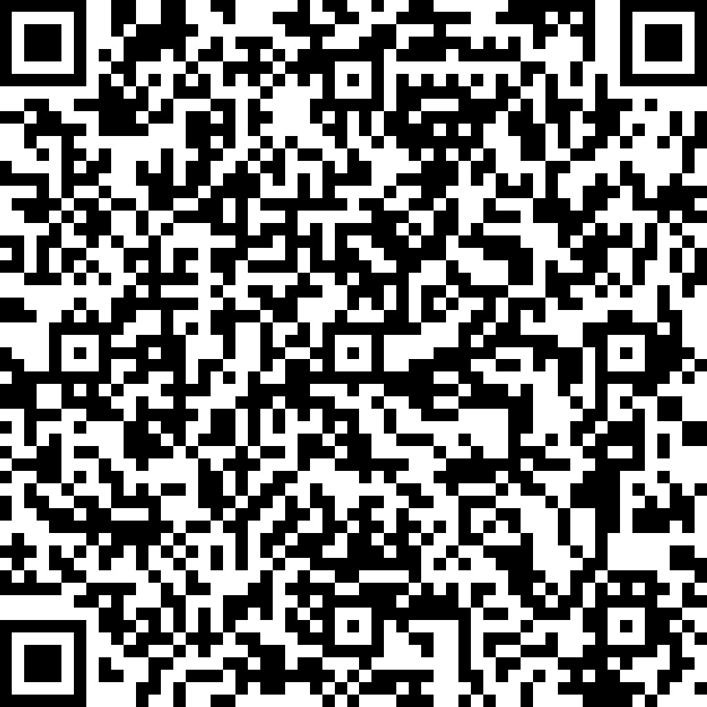

# AllCodeRelay

Universal code scanner with webhook integration.

Developed by [Grapph](https://grapph.com)

Download on [Google Play](https://play.google.com/store/apps/details?id=com.grapph.allcoderelay)

Pre-order on [App Store](https://apps.apple.com/us/app/allcoderelay/id6447867807)


## Features

- QR Code and Barcode scanning
- NFC tag reading
- Webhook integration for sending scanned data
- Secure storage of webhook URLs
- Customizable settings

## Getting Started

This Flutter application requires Flutter 3.24 or higher.

### Prerequisites

- Flutter SDK (3.24+)
- Dart SDK (3.7.2+)
- Android Studio / Xcode for mobile deployment

### Installation

1. Clone the repository
2. Run `flutter pub get` to install dependencies
3. Connect a device or start an emulator
4. Run `flutter run` to start the application

## Dependencies

- mobile_scanner: For 2D/3D code scanning
- nfc_manager: For NFC reading
- http: For webhook communication
- flutter_bloc: For state management
- go_router: For navigation
- flutter_secure_storage: For secure storage of webhook URLs
- And more (see pubspec.yaml for complete list)

## Usage

Scan QR codes, barcodes, or NFC tags and relay the data to configured webhook endpoints.

## Webhook Integration

AllCodeRelay sends scanned data to your configured webhook endpoint via HTTP POST requests.

### Configuration

You can configure webhook settings in the app:

- **Webhook URL**: The endpoint that will receive scan data
- **Webhook Title**: A friendly name for your endpoint
- **Custom Headers**: Add authentication tokens or other required headers

### QR Code Configuration

Configure the app by scanning a special QR code with this format:

```
allcoderelay://setwebhookurl?url=https://your-webhook.com&title=My%20Webhook&headers={"Authorization":"Bearer%20token","Content-Type":"application/json"}
```

Use our [webhook configuration tool](https://grapph.com/allcoderelay/webhook_config.php) to easily generate these QR codes.

### POST Request Format

When a code is scanned, the app sends a POST request with this structure:

```json
{
  "code": "SCANNED_CODE_VALUE"
}
```

### Expected Response

Your webhook should return a JSON response with this structure:

```json
{
  "code": "SCANNED_CODE_TYPE",
  "codevalue": "PROCESSED_VALUE"
}
```

Where:

- `code`: Type of code scanned (e.g., "QR", "BARCODE", "NFC")
- `codevalue`: The processed value or meaning of the code

If the server returns a non-200 status code or the response cannot be parsed, the app will store the scan locally.

### Default Webhook

The app comes with a default webhook URL set to `https://n8n.grapph.com/webhook/allcoderelay`. This webhook is designed to work out-of-the-box and can be used for testing purposes.

This n8n workflow provides several intelligent responses based on the scanned code:

- EAN 13 Barcodes: Returns a link to product information
- NFC Door Tags: Returns a link to open the door
- Other QR, Aztec, or Data Matrix Codes: Uses AI to analyze and provide information about the scanned code

The workflow includes:

- code type detection
- integration with OpenAI for AI analysis
- SerpAPI for product information lookup
- conditionals for different code types

You can view an example of this [workflow](https://grapph.com/allcoderelay/allcoderelay.json) in the n8n workflow file included with this documentation.

To use this workflow, you need to:

- Import the workflow into n8n
- Set the OpenAI and SerpAPI API keys in the workflow
- Update the webhook URL in the app to point to your n8n instance


### Another funny webhook worth to test



### Example Implementation

A simple PHP webhook endpoint:

```php
<?php
header('Content-Type: application/json');

// Get the POST data
$input = file_get_contents('php://input');
$data = json_decode($input, true);

// Process the scanned code
$scannedCode = $data['code'] ?? '';

// Return the processed data
echo json_encode([
  'code' => 'QR',
  'codevalue' => 'Processed: ' . $scannedCode
]);
?>
```

## Contact

Email: allcoderelay@grapph.com
